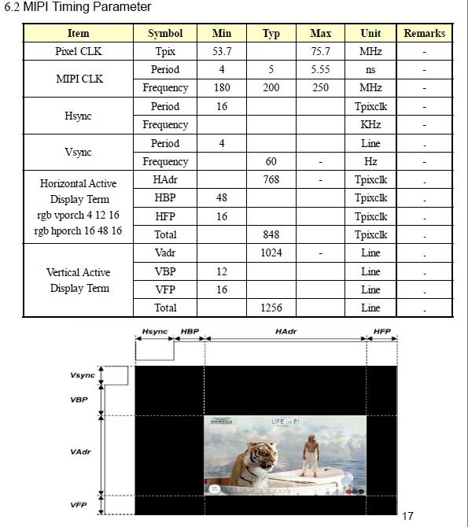
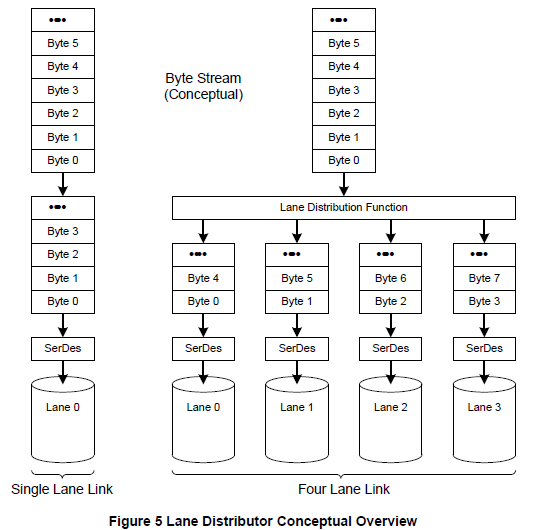
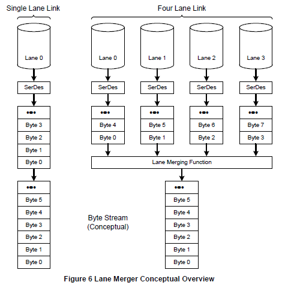
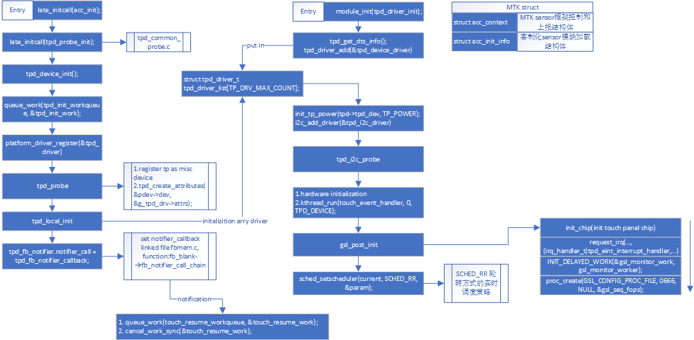
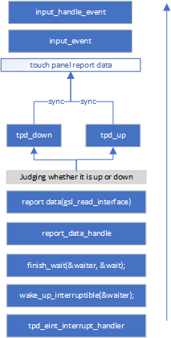
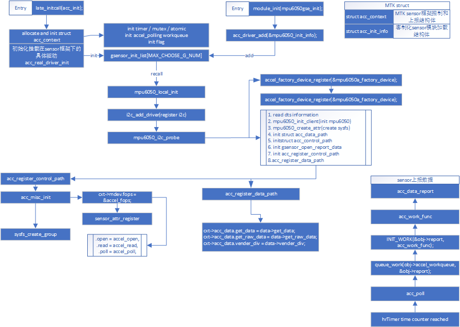
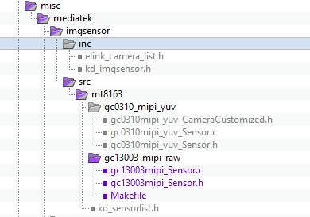

# 工作总结，2019年2月

[TOC]

---

## Makefile and Kconfig

### Makefile	

- 作用

  > 编译文件

---

### Kconfig

- 作用

  > 1. Linux Kernel 配置索引文件，索引Linux 文件目录，模块。 
  > 2. 运行 `make menuconfig` 可以查看的目录。

- Kconfig 编写规则

---

## Linux Defferring Mechanism

### workequeue

- Defined in `<linux/workqueue.h>`

- Workqueue structure

  - `struct work_struct`

    ```C
    struct work_struct {
    	atomic_long_t data;
    	struct list_head entry;
    	work_func_t func;
    #ifdef CONFIG_LOCKDEP
    	struct lockdep_map lockdep_map;
    #endif
    };
    ```

  - `struct workqueue_struct`

    ```C
    struct workqueue_struct {
    	struct list_head	pwqs;		/* WR: all pwqs of this wq */
    	struct list_head	list;		/* PL: list of all workqueues */
    
    	struct mutex		mutex;		/* protects this wq */
    	int			work_color;	/* WQ: current work color */
    	int			flush_color;	/* WQ: current flush color */
    	atomic_t		nr_pwqs_to_flush; /* flush in progress */
    	struct wq_flusher	*first_flusher;	/* WQ: first flusher */
    	struct list_head	flusher_queue;	/* WQ: flush waiters */
    	struct list_head	flusher_overflow; /* WQ: flush overflow list */
    
    	struct list_head	maydays;	/* MD: pwqs requesting rescue */
    	struct worker		*rescuer;	/* I: rescue worker */
    
    	int			nr_drainers;	/* WQ: drain in progress */
    	int			saved_max_active; /* WQ: saved pwq max_active */
    
    	struct workqueue_attrs	*unbound_attrs;	/* WQ: only for unbound wqs */
    	struct pool_workqueue	*dfl_pwq;	/* WQ: only for unbound wqs */
    
    #ifdef CONFIG_SYSFS
    	struct wq_device	*wq_dev;	/* I: for sysfs interface */
    #endif
    #ifdef CONFIG_LOCKDEP
    	struct lockdep_map	lockdep_map;
    #endif
    	char			name[WQ_NAME_LEN]; /* I: workqueue name */
    
    	/* hot fields used during command issue, aligned to cacheline */
    	unsigned int		flags ____cacheline_aligned; /* WQ: WQ_* flags */
    	struct pool_workqueue __percpu *cpu_pwqs; /* I: per-cpu pwqs */
    	struct pool_workqueue __rcu *numa_pwq_tbl[]; /* FR: unbound pwqs indexed by node */
    };
    ```

- Usage

  - Declaration

    - Static

      `DEFINE_MUTEX(lock);`

    - Dynamic

      1. Declare the work and workqueue

          `struct work_struct           foo_work;`

          `struct workqueue_struct      foo_workqueue;`

      2. Define the worker function (the handler)

         `static void foo_workqueue_recall(struct work_struct *work)`

      3. 初始化workqueue        

         `INIT_WORK(&foo_work, foo_workqueue_recall);`

         启动调度 			

      ` schedule_work(&foo_work);`

    

- API

  

- Example

  ```C
  static struct work_struct           foo_work;
  static struct workqueue_struct      foo_workqueue;
  
  static void foo_workqueue_recall(struct work_struct *work)
  {
      static int counter = 0;
      static int repeate_workqueue_recall = 1;
      
      usr_msg("counter = %d", counter);
      counter++;
  
      if(1 == repeate_workqueue_recall && counter < 10) {
          msleep(1000);
          schedule_work(&foo_work);
      } else {
          schedule();                         // give up cpu using authority
          usr_msg("workqueue scheduled");     // program will approach here once
      }
  }
  // 创建工作队列
  int foo_workqueue_init(void)
  {
      INIT_WORK(&foo_work, foo_workqueue_recall);
      schedule_work(&foo_work);               // or queue_work(system_wq, work);
      usr_msg("workqueue init success");
  }
  // 移除工作队列
  void foo_workqueue_remove(void)
  {
      cancel_work_sync(&foo_work);
      destroy_work_on_stack(&foo_work);
      usr_msg("workqueue removed");
  }
  ```


#### **create_singlethread_workqueue and create_workqueue**

> **create_singlethread_workqueue:**  工作队列始终在同一CPU核心上运行，从创建到工作到调度都是在同一CPU上运行。
>
> **create_workqueue:** create_workqueue同样会分配一个wq的工作队列，但是不同之处在于，对于多CPU系统而言，对每一个CPU，都会为之创建一个per-CPU的cwq结构，对应每一个cwq，都会生成一个新的worker_thread进程。但是当用queue_work向cwq上提交work节点时，是哪个CPU调用该函数，那么便向该CPU对应的cwq上的worklist上增加work节点。

### waitqueue

- Defined in `<linux/wait.h> <linux/workqueue.h>` 
- Workqueue structure


- Example

  ```C
  static DECLARE_WAIT_QUEUE_HEAD(foo_queue_head);
  // static struct wait_queue_head_t     foo_queue_head;     // not recommended definition
  static struct work_struct           foo_queue_work;
  static int condition = 1;
  
  static void foo_queue_recall_function(struct work_struct *work)
  {
      static int foo_waitqueue_repeat_schedule = 1;
      
      usr_msg("get in waitqueue recall fuction, current condition = %d", condition);
      condition += 1;
      wake_up_interruptible(&foo_queue_head);
      usr_msg("queue has been woke-up, current condition = %d", condition);
      // reschedule 10 times
      if(1 == foo_waitqueue_repeat_schedule && counter < 10) {
          msleep(1000);
          schedule_work(&foo_queue_work);
      }
     else {
         // after 10 times schedule_work, program will be suspend
         usr_msg("skip wake_up_interruptible, condition = %d", condition);
     }
  }
  
  void foo_waitqueue_init(void)
  {
      init_waitqueue_head(&foo_queue_head);
      INIT_WORK(&foo_queue_work, foo_queue_recall_function);
      schedule_work(&foo_queue_work);
  }
  
  void foo_remove_waitqueue(void)
  {
      void remove_wait_queue(wait_queue_head_t *q, wait_queue_t *wait);
  }
  ```

  


### Tasklet

- Defined in `<linux/interrupt.h>` 
- Workqueue structure


- Example

  ```C
  static unsigned char foo_tasklet_data[] = "tasklet data, unsigned char format";
  void foo_tasklet_recall(unsigned long data);
  // #define DECLARE_TASKLET(name, func, data) \
  //          struct tasklet_struct name = { NULL, 0, ATOMIC_INIT(0), func, data }
  // name ---> struct tasklet_struct
  // data ---> unsigned long
  DECLARE_TASKLET(foo_tasklet, foo_tasklet_recall, (unsigned long)foo_tasklet_data);
  
  void foo_tasklet_recall(unsigned long data)
  {
      static int counter = 0;
      static int foo_tasklet_repeat_schedule = 1;
      
      usr_msg("transfered data is : %s", (unsigned char *)data);
      counter++;
      usr_msg("foo_tasklet_recall loop counter = %d", counter);
      
      // reschedule 10 times
      if(1 == foo_tasklet_repeat_schedule && counter < 10) {
          // msleep(1000);
          mdelay(1000);
          tasklet_schedule(&foo_tasklet);
      }
  }
  
  void foo_tasklet_init(void)
  {
      // start schedule tasklet
      tasklet_schedule(&foo_tasklet);
      usr_msg("tasklet_scheduled");
  }
  
  void foo_tasklet_exit(void)
  {
      tasklet_disable_nosync(&foo_tasklet);  // system will be stucked if delete this
      tasklet_kill(&foo_tasklet);
      usr_msg("tasklet_killed");
  }
  ```

  


### Soft_IRQ / IRQ

**TODO**

### kthread

**TODO**


### Summary

- workqueue Versus Tasklet

  > workqueue相当于线程，因此可以睡眠，可以等待。tasklet本身是在软中断里执行的，必须保证原子操作。


## File System

### Kobject

**TODO**

---

### DEVICE_ATTR

- Defined in `<linux/device.h>`

- prototype

  - `#define DEVICE_ATTR(_name, _mode, _show, _store) \
    struct device_attribute dev_attr_##_name = __ATTR(_name, _mode, _show, _store)`

- Description

  >  ER_ATTR，BUS_ATTR，CLASS_ATTR。区别就是，DEVICE_ATTR对应的文件在**/sys/devices/**目录中对应的device下面。而其他几个分别在driver，bus，class中对应的目录下。

### device_xxxx_file

- **device_create_file**

  - Defined in `<linux/device.h>`

  - prototype

    - `int device_create_file(struct device *dev, const struct device_attribute *attr)`

  - Usage

    > 1. 创建属性文件
    >    1. DEVICE_ATTR
    > 2. 调用`device_create_file`创建文件

  - example_1

  ```C
  #define TAG                         "<OLED>"
  #define USR_MSG_LEVEL               KERN_WARNING
  #define USR_ERR_LEVEL               KERN_ERR
  #define usr_msg(fmt, args...)       printk(USR_MSG_LEVEL TAG ""fmt"\n", ##args)
  #define err_msg(fmt, args...)       printk(USR_ERR_LEVEL TAG " (function : %s), [line : %d] "fmt"\n",__func__, __LINE__, ##args)
  
  static ssize_t dev_show(struct device *dev, struct device_attribute *attr,
  		char *buf)
  {
  	usr_msg("---> device attribute show");
  	return 0;
  }
  static ssize_t dev_store(struct device *dev, struct device_attribute *attr,
  		 const char *buf, size_t count)
  {
  	usr_msg("---> device attribute store");
  	return 0;
  }
  
  static const struct device_attribute dev_attr = {
  	.attr = {
  		.name = OLED_DEV_NAME,
  		.mode = 0664,
  	},
  	.show  = dev_show,
  	.store = dev_store,
  };
  
  static int oled_probe(struct platform_device *pdev)
  {
      ...
  	device_create_file(&pdev->dev , &dev_attr); 
  	...
  }
  ```
  - example_2

  ```C
  ** TODO **
  - using DEVICE_ATTR
  ```

- **device_create_file 函数调用流程**

  ```mermaid
  graph LR
  	A[device_create_file] --> B[sysfs_create_file]
  	B --> C[sysfs_create_file_ns]
  	C --> D[sysfs_add_file_mode_ns]
  ```

- **device_remove_file 函数调用流程**

  ```mermaid
  graph LR
  	A[device_remove_file] --> B[sysfs_remove_file]
  	B --> C[sysfs_remove_file_ns]
  	C --> D[kernfs_remove_by_name_ns]
  ```

  

- **device_remove_file**

  - Defined in `<linux/device.h>`

  - prototype

    - `void device_remove_file(struct device *dev, const struct device_attribute *attr);`

    


### sysfs_create_xxx

- Defined in `<linux/sysfs.h>`

- device_create_file 调用流程中有 sysfs_create_file

  

### proc_create

- Defined in `<linux/proc_fs.h>`

- prototype

  ```C
  static inline struct proc_dir_entry *proc_create(
  	const char *name, umode_t mode, struct proc_dir_entry *parent,
  	const struct file_operations *proc_fops)
  {
  	return proc_create_data(name, mode, parent, proc_fops, NULL);
  }
  ```

- Function

  > 创建文件接口给上层调用。如果**`parent`** 值为NULL则创建的文件路径为 **`/proc`** 下。
  >
  > 如果**`parent`**不为NULL则在对应的**`parent`**目录下创建文件系统。

- Example

  ```C
  static struct file_operations foo_fops = {
      .read           = foo_read,
      .write          = foo_write,
      .open           = foo_open,
      .release        = foo_close,
      .unlocked_ioctl = foo_ioctl,
  };
  
  #define FOO_PROC_NAME   "foo_proc"
  struct proc_dir_entry   *foo_proc_dir;
  
  int foo_proc_create(void)
  {
      foo_proc_dir = proc_create(FOO_PROC_NAME, 0666, NULL, &foo_fops);
      if(IS_ERR(foo_proc_dir)){
          return -ENOMEM;
      }
      return 0;
  }
  ```

- 调用流程

  ```mermaid
  graph LR
  	proc_create --> proc_create_data
  	proc_create_data --> proc_register
  ```

---

### module_param

- Defined in `<linux/moduleparam.h>`

- prototype

  > #define module_param(name, type, perm)				\
  > 	module_param_named(name, name, type, perm)

- Function

  > module_param(name, type, perm)是一个宏，表示向当前模块传入参数。参数用 module_param 宏定义来声明。定义可以放在任何函数之外, 典型地是出现在源文件的前面。

- Example

  ```C
  static char *whom = "world";
  static int howmany = 1;
  module_param(howmany, int, S_IRUGO);
  module_param(whom, charp, S_IRUGO);
  // or:
  module_param(debug_enable_led, int, 0644);
  ```

---

### EXPORT_SYMBOL

- Defined in `<linux/moduleparam.h>`

- prototype

  > #define module_param(name, type, perm)				\
  > 	module_param_named(name, name, type, perm)

- Function

  > EXPORT_SYMBOL标签内定义的函数或者符号对全部内核代码公开，不用修改内核代码就可以在您的内核模块中直接调用，即使用EXPORT_SYMBOL可以将一个函数以符号的方式导出给其他模块使用。

- usage

  > 1. 在模块函数定义之后使用EXPORT_SYMBOL（函数名）
  > 2. 在调用该函数的模块中使用extern对之声明
  > 3. 首先加载定义该函数的模块，再加载调用该函数的模块

---

### MODULE_DEVICE_TABLE

- Defined in `<linux/module.h>`

- prototype

  ```C
  #ifdef MODULE
  /* Creates an alias so file2alias.c can find device table. */
  	#define MODULE_DEVICE_TABLE(type, name)					\
  	extern const typeof(name) __mod_##type##__##name##_device_table		\
    	__attribute__ ((unused, alias(__stringify(name))))
  #else  /* !MODULE */
  	#define MODULE_DEVICE_TABLE(type, name)
  #endif
  ```

- Function

  > Creates an alias so file2alias.c can find device table.

- Example

  ```C
  static const struct of_device_id oled_i2c_of_match[] = {
  	{.compatible = "oled,ssd1306"},
  	{/* keep this */}
  };
  MODULE_DEVICE_TABLE(of, oled_i2c_of_match);
  ```

---

## Mutex / Lock

### Mutex

- Defined in `<linux/mutex.h>`

- Mutex structure

  ```C
  struct mutex {
  	/* 1: unlocked, 0: locked, negative: locked, possible waiters */
  	atomic_t		count;
  	spinlock_t		wait_lock;
  	struct list_head	wait_list;
  #if defined(CONFIG_DEBUG_MUTEXES) || defined(CONFIG_MUTEX_SPIN_ON_OWNER)
  	struct task_struct	*owner;
  #endif
  #ifdef CONFIG_MUTEX_SPIN_ON_OWNER
  	struct optimistic_spin_queue osq; /* Spinner MCS lock */
  #endif
  #ifdef CONFIG_DEBUG_MUTEXES
  	const char 		*name;
  	void			*magic;
  #endif
  #ifdef CONFIG_DEBUG_LOCK_ALLOC
  	struct lockdep_map	dep_map;
  #endif
  };
  ```

- Usage

  - Declaration

    - static

       `DEFINE_MUTEX(lock);`

    - dynamic

        `struct mutex lock;`
      
       `mutex_init(&lock);`

  - Lock

     `mutex_lock(&lock);`

  - Unlock

     `mutex_unlock(&lock);`

  - Destroy mutex

     `mutex_destroy(&lock);`

- API

  `void mutex_lock(struct mutex *lock);`

  `int mutex_lock_interruptible(struct mutex *lock);`

  `int mutex_lock_killable(struct mutex *lock);`

  `int mutex_trylock(struct mutex *lock);`

  `int mutex_is_locked(struct mutex *lock);`

  `void mutex_unlock(struct mutex *lock);`

### Spin_lock

- Defined in file `<linux/spinlock.h>`

- Spinlock structure

  ```C
  typedef struct spinlock {
  	union {
  		struct raw_spinlock rlock;
  
  #ifdef CONFIG_DEBUG_LOCK_ALLOC # define LOCK_PADSIZE (offsetof(struct raw_spinlock, dep_map))
  		struct {
  			u8 __padding[LOCK_PADSIZE];
  			struct lockdep_map dep_map;
  		};
  #endif
  	};
  } spinlock_t;
  ```

  

- prototype

  ```C
  static inline void spin_lock(spinlock_t *lock)
  {
  	raw_spin_lock(&lock->rlock);
  }
  ```

- Usage

  - Declaration

    `spinlock_t lock;`

    `spin_lock_init(lock);`

  - Lock

    `spin_lock(&lock);`

  - Unlock

    `spin_unlock(&lock);`

- API

  `static inline void spin_lock(spinlock_t *lock)`

  `static inline int spin_trylock(spinlock_t *lock)`

  `int mutex_lock_killable(struct mutex *lock);`

  `int mutex_trylock(struct mutex *lock);`

  `int mutex_is_locked(struct mutex *lock);`

  `void mutex_unlock(struct mutex *lock);`

- **`spin_lock` and `raw_spin_lock`**

  function recall loop

  ```mermaid
  graph LR
  	spin_lock --> raw_spin_lock
  	spin_xxxx --> raw_spin_xxxx
  ```

  ```C
  static inline void spin_lock(spinlock_t *lock)
  {
  	raw_spin_lock(&lock->rlock);
  }
  ```

  

### Atomic lock

- Defined in file `<linux/atomic.h>`

- Spinlock structure

  ```C
  typedef struct {
  	int counter;
  } atomic_t;
  ```

- Usage

  - Declaration

    `atomic_t ato;`

- API

  ```C
  #ifndef atomic_read
  	#define atomic_read(v)	ACCESS_ONCE((v)->counter)
  #endif
  
  #define ATOMIC_INIT(i)	{ (i) }
  
  /**
   * atomic_read - read atomic variable
   * @v: pointer of type atomic_t
   *
   * Atomically reads the value of @v.
   */
  #ifndef atomic_read
  #define atomic_read(v)	ACCESS_ONCE((v)->counter)
  #endif
  
  /**
   * atomic_set - set atomic variable
   * @v: pointer of type atomic_t
   * @i: required value
   *
   * Atomically sets the value of @v to @i.
   */
  #define atomic_set(v, i) (((v)->counter) = (i))
  
  #include <linux/irqflags.h>
  
  static inline int atomic_add_negative(int i, atomic_t *v)
  {
  	return atomic_add_return(i, v) < 0;
  }
  
  static inline void atomic_add(int i, atomic_t *v)
  {
  	atomic_add_return(i, v);
  }
  
  static inline void atomic_sub(int i, atomic_t *v)
  {
  	atomic_sub_return(i, v);
  }
  
  static inline void atomic_inc(atomic_t *v)
  {
  	atomic_add_return(1, v);
  }
  
  static inline void atomic_dec(atomic_t *v)
  {
  	atomic_sub_return(1, v);
  }
  
  #define atomic_dec_return(v)		atomic_sub_return(1, (v))
  #define atomic_inc_return(v)		atomic_add_return(1, (v))
  
  #define atomic_sub_and_test(i, v)	(atomic_sub_return((i), (v)) == 0)
  #define atomic_dec_and_test(v)		(atomic_dec_return(v) == 0)
  #define atomic_inc_and_test(v)		(atomic_inc_return(v) == 0)
  ```

---

### Spin_lock Versus Mutex

> 1. spin_lock 之后可以执行中断上下文操作，Mutex不能执行中断上下文操作。
> 2. Mutex 锁定期间不能执行中断操作。

---

## Linux 文件操作

**TODO**


---

## Linux Kernel Data Struction

###  container_of

- defined in file `<linux/kernel.h>`

- prototype

  ```C
  /**
   * container_of - cast a member of a structure out to the containing structure
   * @ptr:	the pointer to the member.
   * @type:	the type of the container struct this is embedded in.
   * @member:	the name of the member within the struct.
   *
   */
  #define container_of(ptr, type, member) ({			\
  	const typeof( ((type *)0)->member ) *__mptr = (ptr);	\
  	(type *)( (char *)__mptr - offsetof(type,member) );})
  ```

- Description

  > 通过一个结构变量中一个成员的地址找到这个结构体变量的首地址。

- Example

  ```C
  struct person {
      int 	age;
      int 	salary;
      char 	*name;
  };
  ...
  struct person somebody;
  [...]
  int *age_ptr = &somebody.age;
  ...
  struct person *the_person;
  the_person = container_of(age_ptr, struct person, age);
  ```

  

### `xxx_get_xxxdata/xxx_set_xxxdata`

- **i2c**

  - file `<linux/i2c.h>`

  - `i2c_set_clientdata`

    - prototype

      ```C
      static inline void i2c_set_clientdata(struct i2c_client *dev, void *data)
      {
      	dev_set_drvdata(&dev->dev, data);
      }
      ```

  - `i2c_get_clientdata`

    - prototype

      ```C
      static inline void *i2c_get_clientdata(const struct i2c_client *dev)
      {
      	return dev_get_drvdata(&dev->dev);
      }
      ```

  - `i2c_set_adapdata`

    - prototype

      ```C
      static inline void i2c_set_adapdata(struct i2c_adapter *dev, void *data)
      {
      	dev_set_drvdata(&dev->dev, data);
      }
      
      ```

  - `i2c_get_adapdata`

    - prototype

      ```C
      static inline void *i2c_get_adapdata(const struct i2c_adapter *dev)
      {
      	return dev_get_drvdata(&dev->dev);
      }
      
      ```

  - `to_i2c_adapter`

    - prototype

      ```C
      #define to_i2c_adapter(d) container_of(d, struct i2c_adapter, dev)
      ```

  - `to_i2c_client`

    - prototype

      ```C
      #define to_i2c_client(d) container_of(d, struct i2c_client, dev)
      ```

  - `to_i2c_driver`

    - prototype

      ```C
      #define to_i2c_driver(d) container_of(d, struct i2c_driver, driver)
      ```

      

- **platform device**

  - file `<linux/device.h>`

  - `dev_set_drvdata`

    - prototype

      ```C
      static inline void dev_set_drvdata(struct device *dev, void *data)
      {
      	dev->driver_data = data;
      }
      ```

  - `dev_get_drvdata`

    - prototype

      ```C
      static inline void *dev_get_drvdata(const struct device *dev)
      {
      	return dev->driver_data;
      }
      ```

  

---

## DTS

- **dtb = dtsi + dts**

- dts ---> dtb

  ```bash
  <kernel_dir>/scripts/dtc/dtc -I dts -O dtb -o <target_dts_file_name>.dtb <source_dtb_file_name>.dts
  ```

- dtb ---> dts

  ```bash
  <kernel_dir>/scripts/dtc/dtc -I dtb -O dts -o <target_dts_file_name>.dts <source_dtb_file_name>.dtb
  ```

  

### DTS/DTB工具DTC

- dtc 源码位置

  > <kernel>/scripts/dtc/dtc.c
  >
  > <kernel>/scripts/dtc/dtc.h

- 编译成dtc可执行文件后，可以用来将dtc编译成dtb文件或者dtb反编译成dts文件。

### DTS with GPIO subsystem

- dts

```DTS
    laser {
		compatible = "laser";
		label = "laser prot";
		laser-on = <&gpio5 RK_PC3 GPIO_ACTIVE_HIGH>;    
        laser-off = <&gpio5 RK_PC3 GPIO_ACTIVE_LOW>;
		status = "okay";
	};
```

- 驱动读取申请管脚

```c
static int laser_probe(struct platform_device *pdev)
{
    ...
   	struct device_node *laser_node = pdev->dev.of_node;
  	if (!laser_node)
    	return -ENOENT;
  /** of_get_named_gpio 的name 为  laser 节点下 的 laser-on = <&gpio5 RK_PC3 GPIO_ACTIVE_HIGH>; */
  laser_pin = of_get_named_gpio(laser_node, "laser-on", 0);
  if (!gpio_is_valid(laser_pin))
        return -EIO;
    //两种写法都可以
    //ret = devm_gpio_request_one(&pdev->dev ,laser_pin, GPIOF_OUT_INIT_LOW, "laser_pin");
  ret = gpio_request(laser_pin, LASER_NAME);
  if(ret < 0)
        return -EBUSY;
  gpio_direction_output(laser_pin, 0);
  gpio_set_value(laser_pin, 1);

  ...
}
```

### DTS with GPIO pinctrl

- dts

```dts
oled-status {
        compatible = "oled-pins";
        label = "oled-status-pins";
        pinctrl-name = "default",
                        "oled_status_high";
        // GPIO6A1
        pinctrl-0 = <&oled_status_set_low>;
        pinctrl-1 = <&oled_status_set_high>;
        status = "okay";
};

&i2c1 {
    status = "okay";
    clock-frequency = <400000>;
    // ss1306 device id = ((ox3c << 1) | write_read_flag) 
    // 0x3c = 0x78 >> 1
    pinctrl-names = "default";
    pinctrl-0 = <&i2c1_xfer>;
    
    oled: ss1306@3c {
        compatible = "oled,ssd1306";
        reg = <0x3c>;
        width = <128>;
        height = <64>;
        page-offset = <0>;

        status = "okay";
    };
};

&pinctrl {
    // GPIO6A1
    oled_status_set_low: oled-rst-low {
        pins = <RK_GPIO6 RK_PA1 RK_FUNC_GPIO &pcfg_pull_down>;
        // slew-rate = <1>;
        output-low;
    };
    oled_status_set_high: oled-rst-high {
        pins = <RK_GPIO6 RK_PA1 RK_FUNC_GPIO &pcfg_pull_up>;
        // slew-rate = <1>;
        output-high;
    };
    // set i2c1 gpio to pullup, defalut voltage level to high
    i2c1 {
        i2c1_xfer: i2c1-xfer {
            rockchip,pins = <8 4 RK_FUNC_1 &pcfg_pull_up>,
                            <8 5 RK_FUNC_1 &pcfg_pull_up>;
        };
    };
};
```

- 驱动读管脚

```C
static int oled_get_dev_dts_info(struct platform_device * pdev)
{
	int ret;
	struct _oled_dev_dts_info * dts_info;

	dts_info = platform_get_drvdata(pdev);
	
    mutex_lock(&dts_info->dts_lock);
    // get dts gpio configurations
    dts_info->dev_pinctrl = devm_pinctrl_get(&pdev->dev);
    if(IS_ERR(dts_info->dev_pinctrl)) {
        err_msg("error : dts_info->dev_pinctrl");
        ret = PTR_ERR(dts_info->dev_pinctrl);
        return ret;
    }
    dts_info->statu_low = pinctrl_lookup_state(dts_info->dev_pinctrl, "default");
    if(IS_ERR(dts_info->statu_low)) {
        err_msg("error : dts_info->statu_low");
        ret = PTR_ERR(dts_info->statu_low);
        goto err_pin;
    }
    dts_info->statu_high = pinctrl_lookup_state(dts_info->dev_pinctrl, "oled_status_high");
    if(IS_ERR(dts_info->dev_pinctrl)) {
        err_msg("error : dts_info->statu_high");
        ret = PTR_ERR(dts_info->statu_high);
        goto err_pin;
    }
    // set default state
    ret = pinctrl_select_state(dts_info->dev_pinctrl, dts_info->statu_high);
    if(IS_ERR(dts_info->dev_pinctrl)) {
        err_msg("error : set oled_status pin to high");
        ret = -EIO;
        goto err_pin;
    }
	usr_msg("set rest-pin default logic level is high");
    mutex_unlock(&dts_info->dts_lock);

	platform_set_drvdata(pdev, dts_info);

	return ret;
	
err_pin:
	mutex_unlock(&dts_info->dts_lock);
	devm_pinctrl_put(dts_info->dev_pinctrl);
	return ret;
}
```


## 普通字符设备

- **普通字符设备书写流程**

```C

```


- **普通字符设备平台驱动书写流程**


---

## Linux 子系统/框架


### IIC 

- 包含头文件

  `<linux/i2c.h>`


#### I2C 调用流程

```mermaid
graph TB
	A[xxxx_i2c_probe] --> B[dddd]
```


### SPI


### Input 


---

### PWM

- Defined in `<linux/pwm.h>`

- Description

  > Pulse-Width Modulation

- PWM structure

- Usage

- Initialization

- Example

  - dts

    ```dts
    
    ```

    

  - code

    ```C
    
    ```

---

### UART


---

### Timer

#### Standard Timer

- Defined in `<linux/timer.h>`

- **`HZ`**定义在文件 `<linux/jiffies.h>`

- Function

  > 通用定时器/低精度定时器，定时精度在秒级

- Standard timer structure

  ```C
  struct timer_list {
  	/*
  	 * All fields that change during normal runtime grouped to the
  	 * same cacheline
  	 */
  	struct list_head entry;
  	unsigned long expires;
  	struct tvec_base *base;
  
  	void (*function)(unsigned long);
  	unsigned long data;
  
  	int slack;
  
  #ifdef CONFIG_TIMER_STATS
  	int start_pid;
  	void *start_site;
  	char start_comm[16];
  #endif
  #ifdef CONFIG_LOCKDEP
  	struct lockdep_map lockdep_map;
  #endif
  };
  ```

- Usage

  > 1. 声明结构体 struct   `timer_list  foo_time;`
  > 2. 初始化定时器 init_timer(&foo_time);`
  > 3. 设置定时器回调函数 `foo_time.function`
  > 4. 设置回调函数传输的参数 `foo_time.data = (unsigned long)"paramter"`
  > 5. 更新计数器 `foo_time.expires = jiffies + N * HZ`
  > 6. 启动计数器 `add_timer(&foo_time)`
  >
  > **---------- 回调部分 --- `void foo_timer_callback(unsigned long arg)`----**
  >
  > 7. 读取传送过来的数据 `char * str =(char *)arg ` (此处假定传送过来的为char 类型字符串)
  > 8. 重新装载计数器 `foo_time.expires = jiffies + N * HZ`
  > 9. 重启计数器 `add_timer(&foo_time);`
  > 10. 使用后删除计数器 `del_timer(&foo_time);`

- Initialization

  > 初始化定时器为初始化 `struct timer_list` 结构体

- Example

  ```C
  // MS 转换成 NS， 1E6需要连接数学库
  // #define MS_TO_NS(x) 	(x * 1E6L)      // ms to ns
  #define MS_TO_NS(x) 	(x * 1000000UL)      // ms to ns
  
  struct   mutex       foo_mutex;
  struct   timer_list  foo_time;
  struct   timeval     old_tmval;
  
  // recall function
  void foo_timer_callback(unsigned long arg)
  {
      struct timeval 	tm_val;
      static int loop_counter = 0;
      
      char * strs = (char *) arg;
      // transferd in args
      usr_msg("got transferred args is : %s", strs);
      // get current time
      do_gettimeofday(&tm_val);
      // calculator interval_time
      usr_msg("interval time is %ld sencond", tm_val.tv_sec - old_tmval.tv_sec);
  
      old_tmval = tm_val;
      //test timer counter set from 1s to 10 second
      usr_msg("loop = %d", loop_counter);
      // update time counter
      foo_time.expires = jiffies + loop_counter * HZ;    
      loop_counter++;
      add_timer(&foo_time);                    //recount
  }
  
  int foo_timer_init(void)
  {
      int retval = 0;
      mutex_lock(&foo_mutex);
      init_timer(&foo_time);              			// init kernel timer
      do_gettimeofday(&old_tmval);        			// get current time
      foo_time.function = foo_timer_callback;         // set call back function
      // set call back function transfer parameter
      foo_time.data = (unsigned long) "---> transfer param";   
      foo_time.expires = jiffies + 1 * HZ;            // set counter timer to 1 sencod
      add_timer(&foo_time);               			// add timer to kernel list
      mutex_unlock(&foo_mutex);           
      return retval;
  }
  
  // delete timer when needed or remove driver
  retval = del_timer(&foo_time);
  
  ```

------

#### High Density Timer (HRTs)

- Defined in `<linux/moduleparam.h>`

- Function

  > 高精度定时器，定时精度在纳秒级

- High density timer structure

  ```C
  struct hrtimer {
  	struct timerqueue_node		node;
  	ktime_t						_softexpires;
  	enum hrtimer_restart		(*function)(struct hrtimer *);
  	struct hrtimer_clock_base	*base;
  	unsigned long				state;
  #ifdef CONFIG_TIMER_STATS
  	int							start_pid;
  	void						*start_site;
  	char						start_comm[16];
  #endif
  };
  ```

- Usage

  > 1. 初始化定时器
  > 2. 回调中需要重新

- Initialization

  

- Example

  ```C
  #define MS_TO_NS(x) (x * 1E6L)      // ms to ns
  struct mutex    foo_mutex;
  static struct   hrtimer     foo_timer;
  static struct   timeval     old_tmval;
  static ktime_t  tm_period;
  
  static enum hrtimer_restart foo_hrtimer_callback(struct hrtimer * arg)
  {
      ktime_t now = arg->base->get_time();
      usr_msg("timer running at jiffies=%ld\n", jiffies);
      hrtimer_forward(arg, now, tm_period);
      return HRTIMER_RESTART;
  }
  
  void foo_timer_init(void)
  {
      mutex_lock(&foo_mutex);
      // param1: second, param2:nanosecond
      // ktime_set(const s64 secs, const unsigned long nsecs); 
      tm_period = ktime_set(0, MS_TO_NS(1000));   // set 1second, 1000 nanosecond.
      hrtimer_init(&foo_timer, CLOCK_REALTIME, HRTIMER_MODE_REL);
      foo_timer.function = foo_hrtimer_callback;
      hrtimer_start(&foo_timer, tm_period, HRTIMER_MODE_REL);
      mutex_unlock(&foo_mutex);
  }
  
  int foo_timer_exit(void)
  {
      int err;
      err = del_timer(&foo_time);
      if (err)
          err_msg("The timer is still in use...");
  }
  ```

  

------

## PMIC(Power Management IC)

**TODO**

---

## Android Kernel

### Android.mk

- Description

  > Android.mk是Android提供的一种makefile文件，用来指定诸如编译生成so库名、引用的头文件目录、需要编译的.c/.cpp文件和.a静态库文件

#### Android.mk语法

- LOCAL_PATH := $(call my-dir) 
  每个Android.mk文件必须以定义LOCAL_PATH为开始。它用于在开发tree中查找源文件。宏my-dir 则由Build System提供。返回包含Android.mk的目录路径。

- include $(CLEAR_VARS) 
  CLEAR_VARS 变量由Build System提供。并指向一个指定的GNU Makefile，由它负责清理很多LOCAL_xxx.
  例如：LOCAL_MODULE, LOCAL_SRC_FILES, LOCAL_STATIC_LIBRARIES等等。但不清理LOCAL_PATH.
  这个清理动作是必须的，因为所有的编译控制文件由同一个GNU Make解析和执行，其变量是全局的。所以清理后才能避免相互影响。

- LOCAL_MODULE    := Module_Name 

LOCAL_MODULE模块必须定义，以表示Android.mk中的每一个模块。名字必须唯一且不包含空格。Build System会自动添加适当的前缀和后缀。例如，foo，要产生动态库，则生成libfoo.so. 但请注意：如果模块名被定为：libfoo.则生成libfoo.so. 不再加前缀


- LOCAL_MODULE_PATH :=$(TARGET_ROOT_OUT) 指定最后生成的模块的目标地址

- TARGET_ROOT_OUT : 根文件系统，路径为out/$(TARGET_ROOT_OUT)/root

- TARGET_OUT             : system文件系统，路径为out/$(TARGET_ROOT_OUT)/system

- TARGET_OUT_DATA   : data文件系统，路径为out/$(TARGET_ROOT_OUT)/data

- TARGET_XXX_XXX

  - 用于将生成的模块拷贝到输出目录的不同路径，默认是TARGET_OUT

- LOCAL_SRC_FILES := Module_Name.c 

  > LOCAL_SRC_FILES变量必须包含将要打包如模块的C/C++ 源码。不必列出头文件，build System 会自动帮我们找出依赖文件。缺省的C++源码的扩展名为.cpp. 也可以修改，通过LOCAL_CPP_EXTENSION


- `include $(BUILD_SHARED_LIBRARY)` 

  > BUILD_SHARED_LIBRARY：是Build System提供的一个变量，指向一个GNU Makefile Script。
  > 它负责收集自从上次调用 include $(CLEAR_VARS)  后的所有LOCAL_XXX信息。并决定编译为什么。

- BUILD_STATIC_LIBRARY      ：编译为静态库。 
- BUILD_SHARED_LIBRARY   ：编译为动态库 
- BUILD_EXECUTABLE            ：编译为Native C可执行程序  
- BUILD_PREBUILT                 ：该模块已经预先编译

---

### Android 平台驱动测试

- 适用范围（所有Android 平台）

1. 把linux平台测试代码`<filename>.c/cpp`放入`system\extras`文件夹，可以在文件夹内新建目录(推荐建立目录)

   - 如下添加Android Debug模式下的su命令

     

2. 添加或更改 Android.mk文件，将模测试代码编译成可执行文件

3. 编译，在更改后的文件目录运行命令**`mm`**命令，即可编译当前目录下的所有文件，如果不成功，执行以下操作，索引Android源码

   1. `source build/envsetup.sh`
   2. `lunch`

4. 编译后可以通过 **`ADB 的 push`** 命令推送bin文件到Android设备

---

## ADB

### ADB 命令

**TODO**

---

## MTK 部分

**NOTE:** 除特说明外，MTK部分 所有文件及文件路径以 **<u>Android 8.1及 Linux kernel 3.18</u>** 为例

### MTK 编译

- 只更改vendor目录下的文件，只需要编译LK即可。
- 只更改kernel目录下的驱动文件，只需要编译 kernel和bootimage即可。

### MTK 屏幕驱动

#### MTK LCD驱动移植步骤

- **需要更改的文件**

  - `kernel-xxx/drivers/misc/mediatek/lcm/elink_lcm`

    - > 存放不同的lcm驱动文件， kernel 部分

  - `vendor/mediatek/proprietary/bootable/bootloader/lk/dev/lcm/elink_lcm`

    - >  存放不同的lcm驱动文件， boot 部分

  - `kernel-xxx/drivers/misc/mediatek/lcm/elink_lcm`

    - >  声明添加在kernel的lcm驱动文件

  - `vendor/mediatek/proprietary/bootable/bootloader/lk/dev/lcm/elink_lcm`

    - >  声明添加在boot的lcm驱动文件

    > 平台配置文件

  - `device/mediateksample/<chip_platform>/elink/PCBA/<PCB_version>/ProjectConfig.mk`

  - `device/mediateksample/<chip_platform>/elink/PCBA/<PCB_version>/<chip_platform>.dts`

  - `device/mediateksample/<chip_platform>/elink/PCBA/<PCB_version>/<chip_platform>_debug_defconfig`

  - `device/mediateksample/<chip_platform>/elink/PCBA/<PCB_version>/<chip_platform>_defconfig`

  - `device/mediateksample/<chip_platform>/elink/PCBA/<PCB_version>/<chip_platform>_lk.mk`

  - `device/mediateksample/<chip_platform>/elink/items`

- **移植前确认/检查部分**

  1. 确认按电源键后能够点亮屏幕背光。不能则确认背光引脚电压。
  2. 确认屏幕控制引脚，是否正确。（通用平台，硬件引脚固定可以不确认）
  3. 确定MIPI 的线数。MIPI-DSI, LINE NUMBER

  |    lcm_power_gpio     | lcm_reset_gpio | lcm_te_gpio      |    ext_power_gpio    |
  | :-------------------: | -------------- | ---------------- | :------------------: |
  | lcm 1.8V 电压控制引脚 | lcm reset引脚  | lcm standby 引脚 | lcm 3.3V电压控制引脚 |

  - lcm_te_gpio通常不用，因为驱动文件中没有使用`lcm_suspend`

  - lcm dts 对应位置 : `device/mediateksample/<chip_platform>/elink/PCBA/<PCB_version>/<chip_platform>.dts`

  ```dts
  	elink_lcm: elink_lcm {
  		compatible = "mediatek,elink_lcm";
  		lcm_power_gpio = <&pio 92  0>;
  		lcm_reset_gpio = <&pio 146 0>;
  		lcm_te_gpio    = <&pio 147 0>;
  		ext_power_gpio = <&pio 123 0>;
  		
  		reg-lcm-supply = <&mt_pmic_vrf18_1_ldo_reg>;
  	};
  ```

  > 引脚驱动/配置参考驱动文件: `kernel-xxx\drivers\misc\mediatek\lcm\lcm_gpio.c`

  3. MTK lk 中单独引脚申请及使用方法

     - MTK的lk中引脚申请和使用不能使用linux kernel的gpio requeset引脚申请和gpio使用方法。

     - 引脚申请可以在MTK自带的dct中配置完成。

     - 配置GPIO为输出功能使用方法：

       ```C
       // 引脚定义,引脚编好参考GPIO对照表
       #define GPIO_LCD_BIAS_CTRL     					(19 | 0x80000000)
       // 设置引脚模式,Range GPIO_MODE_00 ---> GPIO_MODE_15
       mt_set_gpio_mode(GPIO_LCD_BIAS_CTRL, GPIO_MODE_00);
       // 设置引脚方向, Value 1. GPIO_DIR_OUT; 2. GPIO_DIR_IN
       mt_set_gpio_dir(GPIO_LCD_BIAS_CTRL, GPIO_DIR_OUT);
       // 设置引脚输出电平,value 1. GPIO_OUT_ONE; 2. GPIO_OUT_ZERO
       mt_set_gpio_out(GPIO_LCD_BIAS_CTRL, GPIO_OUT_ONE);
       ```

       

  4. 

- **更改步骤**

  - **kernel 部分**

  1. 在``kernel-xxx\drivers\misc\mediatek\lcm\elink_lcm`文件夹下新建指定lcm屏幕驱动的文件夹，文件夹命名规则 ( lcdType_lcdPPI_Suppiler) 如 `tv080x0m_ns_xganl_boe`

  

  2. 添加指定屏幕驱动，文件名和文件夹名一致

  

  3. tv080x0m_ns_xganl_boe.c 文件 填充LCM_DRIVER驱动

  如：

  ```C
          LCM_DRIVER tv080x0m_ns_xganl_boe_lcm_drv = {
          	.name           = "tv080x0m_ns_xganl_boe",	// 驱动文件名称
          	.set_util_funcs = lcm_set_util_funcs,
          	.get_params     = lcm_get_params,
          	.init           = lcm_init,
          	.suspend        = lcm_suspend,
          	.resume         = lcm_resume,
          };
  
  ```

  4. 添加Makefile, 将LCD驱动添加到编译过程中

  ```Makefile
  obj-y += tv080x0m_ns_xganl_boe.o
  # CONFIG_MTK_LCM
  ccflags-$(CONFIG_MTK_LCM) += -I$(srctree)/drivers/misc/mediatek/lcm/inc
  ```

  - <u>`CONFIG_MTK_LCM`</u> 在 `<platform>_xxxx_defconfig`中定义

  

  5. 将LCD驱动在elink_lcm_list.c中进行注册。

  文件位置`\kernel-3.18\drivers\misc\mediatek\lcm\elink_lcm\elink_lcm_list.c`

  ```c
  #if defined(MTK_LCM_DEVICE_TREE_SUPPORT)
  	extern LCM_DRIVER lcm_common_drv;
  #else
  	extern LCM_DRIVER tf070mc124_dsi_lcm_drv;
  	...
      // LCM_DRIVER tv080x0m_ns_xganl_boe_lcm_drv; 和具体对应驱动中的结构体名称一致
      extern LCM_DRIVER tv080x0m_ns_xganl_boe_lcm_drv;
  	...
  #endif
  
  LCM_DRIVER *lcm_driver_list[] = {
  #if defined(MTK_LCM_DEVICE_TREE_SUPPORT)
  	&lcm_common_drv,
  #else// End defined(MTK_LCM_DEVICE_TREE_SUPPORT)
  
  
  #if defined(TF070MC124_DSI)
  	&tf070mc124_dsi_lcm_drv,
  #endif
  ...
  // 条件判断宏定义,决定驱动是否被使用。
  #if defined(TV080X0M_NS_XGANL_BOE)
  	&tv080x0m_ns_xganl_boe_lcm_drv,
  #endif
  #endif // End not defined(MTK_LCM_DEVICE_TREE_SUPPORT)
  };
  ```

  

  - **LK/vendor 部分**
    - LK部分和kernel部分大致相同

  1. 在`vendor\mediatek\proprietary\bootable\bootloader\lk\dev\lcm\elink_lcm`文件夹下建立和上一步相同的文件夹

     

  2. 添加驱动，驱动文件格式和kernel部分添加格式相同

  3. 将驱动添加到**elink_lcm_list.c**文件中中

     

  4. Makefile文件编写

     ```makefile
     include $(srctree)/drivers/misc/mediatek/Makefile.custom
     obj-y += tv080x0m_ns_xganl_boe.o
     ```

  - **系统配置部分**

  - **添加LCD驱动至配置文件**

    - FIle : **<chip_platform>_defconfig**, **<chip_platform>__lk.mk**

    - 更改位置

      - `CUSTOM_LK_LCM=<specific lcd driver file name> `
      - `CONFIG_CUSTOM_KERNEL_LCM=<specific lcd driver file name> `

      

  - **更改BOOT_LOGO**

    -  File : **ProjectConfig.mk**, **<chip_platform>__lk.mk**

    - 更改位置

      - `BOOT_LOGO := xxxx`

      

    - 分辨率和宏表示方式查看位置

      - `alps\device\mediatek\common\elink\logo`

  - **设置LCD的像素宽和高**
    - File : **<chip_platform>_defconfig**, **<chip_platform>__lk.mk**
    - 更改位置
      - `CONFIG_LCM_HEIGHT="768"`
      - `CONFIG_LCM_WIDTH="1024"`


#### MTK 屏幕驱动参数配置

- LCD MIPI-CSI 参数计算

  - Pixel Clock Frequency = Total Horizontal Samples * Total Vertical Lines * Refresh Rate

    > Pixel_CLK = (4 + 12 + 16 + 1024) * (16 + 48 + 16 +768) * 60(Hz) = 53729280Hz = 53.729280MHz

  - Total Data Rate (Bandwidth) = Pixel Clock Frequency * Pixel Size (in bits)

    > Bandwidth =  53.729280MHz * 24 bit (3 * 8 / LCM_DSI_FORMAT_RGB888) = 1289.502720MHz 

  - Data Rate per Lane = Total Data Rate (Bandwidth)/Number of Data Lane

    > Data Rate per Lane = 1289.502720MHz / 4(LCM_FOUR_LANE) = 322.375680MHz

  - Bit Clock Frequency ( MIPI CLK ) = Data Rate per Lane / 2 (Two edge sample in MIPI-DSI)

    > Bit Clock Frequency = 322.375680MHz / 2 = 161.187MHz

- 芯片手册中的屏幕参数描述
  

```C
#define FRAME_WIDTH  (768)
#define FRAME_HEIGHT (1024)

#define REGFLAG_DELAY             							0xFE
#define REGFLAG_END_OF_TABLE      							0xFF   // END OF REGISTERS
#define LCM_DSI_CMD_MODE									0

static void lcm_get_params(LCM_PARAMS *params)
{
	memset(params, 0, sizeof(LCM_PARAMS));

	params->type            = LCM_TYPE_DSI;
	// LCD 像素尺寸
	params->width           = FRAME_WIDTH;
	params->height          = FRAME_HEIGHT;
	// LCD 显示器物理尺寸
	params->physical_height = 163;	 // 163 millimeter
	params->physical_width  = 122;   // 122 millimeter

	// enable tearing-free ****
	params->dbi.te_mode 				= LCM_DBI_TE_MODE_DISABLED; //LCM_DBI_TE_MODE_VSYNC_OR_HSYNC;//LCM_DBI_TE_MODE_DISABLED;//LCM_DBI_TE_MODE_VSYNC_ONLY;
	params->dbi.te_edge_polarity		= LCM_POLARITY_FALLING;

// default mode is BURST_VDO_MODE
#if (LCM_DSI_CMD_MODE)
	params->dsi.mode   = CMD_MODE;
#else
	params->dsi.mode   = BURST_VDO_MODE; //SYNC_PULSE_VDO_MODE;//BURST_VDO_MODE;
#endif

	// MIPI-DSI
	/** Command mode setting ---------------------------------------------------*/
    // MIPI-DSI Line Number
	params->dsi.LANE_NUM				= LCM_FOUR_LANE;
	//The following defined the fomat for data coming from LCD engine.
	params->dsi.data_format.color_order = LCM_COLOR_ORDER_RGB;
	params->dsi.data_format.trans_seq   = LCM_DSI_TRANS_SEQ_MSB_FIRST;
	params->dsi.data_format.padding     = LCM_DSI_PADDING_ON_LSB;
	params->dsi.data_format.format      = LCM_DSI_FORMAT_RGB888;
	params->dsi.packet_size             = 256;

	/** Video mode setting -----------------------------------------------------*/
    //because DSI/DPI HW design change, this parameters should be 0 when video mode in MT658X; or memory leakage
	params->dsi.intermediat_buffer_num  = 2; 
	params->dsi.PS                      = LCM_PACKED_PS_24BIT_RGB888;
	params->dsi.word_count              = FRAME_WIDTH*3;
	params->dsi.vertical_sync_active    = 4; 	//4;
	params->dsi.vertical_backporch      = 12; 	//4;
	params->dsi.vertical_frontporch     = 16;  	//8;
	params->dsi.vertical_active_line    = FRAME_HEIGHT;//1322

	params->dsi.horizontal_sync_active  = 16; 	//20;
	params->dsi.horizontal_backporch    = 48; 	//20;
	params->dsi.horizontal_frontporch   = 16; 	//32;
	params->dsi.horizontal_active_pixel = FRAME_WIDTH;//854

	params->dsi.PLL_CLOCK               = 180; // MIPI CLK
}
```

- MTK  LCM上下电流程
  - 参考芯片手册是LCD上下电流程
  - 一般驱动中不使用lcm_suspend函数，lcm_resum和lcm_init代码相同。

#### MTK item

- items 说明
  - item中配置为1, 启动某个传感器、某个功能或是状态设置为使能的状态。 item中配置为0则相反。
  - item 以**items.start**开始以**items.end**结束.

- item 示例

```item
#######################################################################
# item start mark
items.start
############################# Name configs ############################
device.model										LYL1
ums.name											LYL1
bluetooth.HostName									Bluetooth
wlan.SSID											AndoirdAP
ro.product.elink									LYL1H1_8
ro.product.model									LYL1H1_8

############################# Other configs ###########################
ro.product.locale.language							en
ro.product.locale.region							US
# persist.sys.timezone								Asia/Shanghai
# persist.sys.usb.config							mtp,adb

############################# Debug configs ###########################
# 调试串口输出控制，
uart.printk											1		
# enable adb root priority
# adb.root											1
#  set DDR size and baudwidth(prefered don't use)
# PCDDR3_1024MB_2*16Bit     
############################# LCM configs #############################
# LCM 名称，和需要加载的LCM驱动文件名称一致
LCM													tv080x0m_ns_xganl_boe
# 屏幕显示旋转
ro.sf.hwrotation									90
LCM.backlight.coefficient							62
# 屏幕像素密度，图标过小增大像素密度
ro.sf.lcd_density									160	
# lcd backlight level
# LCM.backlight.level								185
############################# TP configs ##############################

touchpanel.config.project							LYL_TP_8
touchpanel.config.x_reverse							0
touchpanel.config.y_reverse							0

############################# Camera configs ##########################
camera.main.imgsensor				
camera.sub.imgsensor				
camera.mainsub.mclk									same
camera.main.orientation								270
camera.sub.orientation								270
camera.mainpdn.level								high
camera.subpdn.level									high

############################# Power configs ###########################
battery.config.info									BM_808_AB_4000

############################# Sensors configs #########################
sensors.orientation.debug 							0
accelerometer.orientation							5
magnetometer.orientation							4
gyroscope.orientation								4

#######################################################################
### Private data ,please do not modify. ###
ro.e.model          LYL1H1_8

#######################################################################
items.end
#######################################################################

```


#### MTK 屏幕驱动其它更改项及注意事项

1. 改屏幕默认方向

- 改item

```txt
# 屏幕显示旋转
ro.sf.hwrotation									90
LCM.backlight.coefficient							62
ro.sf.lcd_density									160	
```

2. 图标显示过小或者过大

- 调整item中的`ro.sf.lcd_density`
- 屏幕分辨率和对应的xgal等表述对应位置

>  路径 ： `device\mediatek\common\elink\logo` 下文件夹 有对应的分辨率和表示符号

#### MTK 屏幕驱动框架

- **TODO**

#### MTK LCD屏调试问题

- LCM驱动编译报错，驱动文件无错误并无明显错误记录
  - 检查对应文件的`PCBA/<board_defconfig>`
  - 查看**CONFIG_CUSTOM_KERNEL_LCM**下LCM驱动添加是否过多，最好兼容的驱动不超过5个。

- Andorid 7.0 LCD 驱动 ---> Android 8.1 LCD 驱动
  - **TODO**


#### MIPI 协议

---



---



---

- 常用MIPI协议帧数据类型

  | Data Type (hex) | Packet Size | Decription                      |
  | :-------------- | :---------- | :------------------------------ |
  | **31H**         | short       | **Sync Event: h-sync End**      |
  | **21H**         | short       | Sync Event: h-sync start        |
  | **11H**         | short       | Sync Event: v-sync start        |
  | **01H**         | short       | Sync Event: v-sync start        |
  | **15H**         | short       | DCS write : 1 parameter         |
  | **05H**         | short       | DCS write : no data             |
  | **39H**         | long        | Log Package : data              |
  | **37H**         | short       | Set maximum return package size |

  - MIPI数据类型定义在文件`<kernel>\include\video\mipi_display.h`中。


### MTK 触摸

#### MTK touch panel移植

- **移植前确认/检查部分**

  - 确认touch panel 的dts文件配置（引脚和中断配置，touchpanel 地址， i2c通道和i2c地址），通用平台引脚固定 ，可以不更改

  ```dts
  &touch {
  	tpd-resolution = <768 1024>;
  	use-tpd-button = <0>;
  	tpd-key-num = <3>;
  	tpd-key-local= <139 172 158 0>;
  	tpd-key-dim-local = <90 883 100 40 230 883 100 40 370 883 100 40 0 0 0 0>;
  	tpd-max-touch-num = <5>;
  	tpd-filter-enable = <1>;
  	tpd-filter-pixel-density = <93>;
  	tpd-filter-custom-prameters = <0 0 0 0 0 0 0 0 0 0 0 0>;
  	tpd-filter-custom-speed = <0 0 0>;
  	pinctrl-names = "default", "state_eint_as_int", "state_eint_output0", "state_eint_output1",
  		"state_rst_output0", "state_rst_output1";
  	pinctrl-0 = <&CTP_pins_default>;
  	pinctrl-1 = <&CTP_pins_eint_as_int>;
  	pinctrl-2 = <&CTP_pins_eint_output0>;
  	pinctrl-3 = <&CTP_pins_eint_output1>;
  	pinctrl-4 = <&CTP_pins_rst_output0>;
  	pinctrl-5 = <&CTP_pins_rst_output1>;
  	status = "okay";
  };
  
  &i2c1 {
  	silead_touch@40 {
  		compatible = "mediatek,silead_touch";
  		reg = <0x40>;
  		
  		interrupt-parent = <&eintc>;
  		interrupts = <10 IRQ_TYPE_EDGE_FALLING>;
  		debounce = <10 0>;
  	};
  };
  ```

  

- **需要更改的文件**

  - `<kernel>/drivers/input/touchscreen/mediatek/`

    - > touch panel 驱动文件添加位置，推荐新建驱动文件夹添加。

    > 平台配置文件

  - `device/mediateksample/<chip_platform>/elink/PCBA/<PCB_version>/ProjectConfig.mk`

  - `device/mediateksample/<chip_platform>/elink/PCBA/<PCB_version>/<chip_platform>.dts`

  - `device/mediateksample/<chip_platform>/elink/PCBA/<PCB_version>/<chip_platform>_xxx_defconfig`

  - `device/mediateksample/<chip_platform>/elink/PCBA/<PCB_version>/<chip_platform>_lk.mk`

  - `device/mediateksample/<chip_platform>/elink/items`

- **移植步骤**

  1. 在TP存放路径`<kernel>/drivers/input/touchscreen/mediatek/`下新建需要移植的 TP 驱动文件夹，以芯片名命名。

     - 如新建文件为**GT9XX**，并将驱动文件放在次目录下。

  2. 更改`<kernel>/drivers/input/touchscreen/mediatek/`路径下的Kconfig 和 Makefile文件，使新添加的驱动

  3. 能够被编译器索引到。

     - Makefile

       ```makefile
       # CONFIG_TOUCHSCREEN_MTK 对应 <chip_platform>_xx_defconfig 中的 CONFIG_TOUCHSCREEN_MTK=y
       ifneq ($(CONFIG_TOUCHSCREEN_MTK),)
       obj-y   +=  mtk_tpd.o tpd_button.o tpd_calibrate.o tpd_debug.o \
       		tpd_default.o tpd_init.o tpd_misc.o tpd_setting.o
       endif
       # CONFIG_TOUCHSCREEN_GT9XX 对应 <chip_platform>_xx_defconfig 中的 CONFIG_TOUCHSCREEN_GT9XX=y
       # touch panel driver for chip GT9271 project LYL1 
       obj-$(CONFIG_TOUCHSCREEN_GT9XX)	+=  GT9XX/
       ```

     - Kconfig

     ```kconfig
     # INPUT_TOUCHSCREEN 对应 <chip_platform>_xx_defconfig 中的 CONFIG_INPUT_TOUCHSCREEN=y 
     ######################################################################
     # TOUCHSCREEN_GT9XX 对应 ProjectConfig 中的   CONFIG_TOUCHSCREEN_GT9XX
     #######################################################################
     if INPUT_TOUCHSCREEN
     config TOUCHSCREEN_GT9XX
     	bool "GT9XX for Mediatek package"
     	default n
     	help
     	  Say Y here if you have GT9XX touch panel.
     
     	  If unsure, say N.
     
     	  To compile this dirver as a module, choose M here: the
     	  module will be called.
     
     source "drivers/input/touchscreen/mediatek/GT9XX/Kconfig"
     #endif
     ```

  4. 在新建的**GT9XX**文件夹下新建Makefile和Kconfig文件

     - Makefile

     - 索引编译GT9XX文件夹下的所有文件和文件夹

       ```makefile
       # Linux driver folder
       ccflags-y += -I$(srctree)/drivers/input/touchscreen/mediatek/GT9XX/
       ccflags-y += -I$(srctree)/drivers/input/touchscreen/mediatek/
       ccflags-y += -I$(srctree)/drivers/misc/mediatek/hwmon/include
       ccflags-y += -I$(srctree)/drivers/input/touchscreen/mediatek/GT9XX/include/config0/
       ccflags-y += -I$(srctree)/drivers/input/touchscreen/mediatek/GT9XX/include/firmware0/
       ccflags-y += -I$(srctree)/drivers/misc/mediatek/include/mt-plat/
       ccflags-y += -I$(srctree)/drivers/misc/mediatek/include/mt-plat/$(MTK_PLATFORM)/include/
       
       obj-y	+=  gt9xx_driver.o
       obj-y	+=  gt9xx_extents.o
       obj-y	+=  gt9xx_update.o
       obj-y	+=  goodix_tool.o
       ```

     - Kconfig

     - 编译选项

       ```kconfig
       #
       # Touchscreen driver configuration
       #
       menu "GT9 Touchscreen Config"
       	depends on TOUCHSCREEN_MTK_GT9XX
       
       #if TOUCHSCREEN_MTK_GT9XX
       
       config GTP_USE_PINCTRL
       	bool "GT9 GPIO use Pinctrl"
       	default n
       	help
       	Say Y here if you build GT9 driver on MTK Phone platform.
       
       	Say N here if you build GT9 driver on MTK Tablet platform.
       ...
       config GTP_SUPPORT_I2C_DMA
       	bool "GT9 support i2c dma"
       	default n
       	help
       	Say Y here if you have GT9 touch panel GTP_SUPPORT_I2C_DMA.
       
       	If unsure, say N.
       ...
       
       #endif
       endmenu
       
       ```

  5. 在item中添加驱动文件

     ```item
     ############################# TP configs ##############################
     # touchpanel.config.project 对应的TP驱动文件校准数据文件，GTP9XX单独数据，可以不配置
     touchpanel.config.project							LYL_TP_8
     touchpanel.config.x_reverse							0
     touchpanel.config.y_reverse							0
     ```

     

  6. 如有需要配置串口调试模式

#### 通用GSLX688驱动移植

- 通用GSLX芯片为GSL3676为例

  - 在目录`<kernel>\drivers\input\touchscreen\mediatek\GSLX688\include\`下添加驱动配置文件。

  

  - 更改**`elink_tp_list.h`**，添加配置文件到此文件中

    - 改动如下

    ```C
    // ----- 配置.h文件包含进路径
    #include "GSL3676_Y100_HK_PG.h"
    //YPD3G
    #include "GSL3676_YPD3G_XC_PG.h"
    // add by jiangquan, project YPD3, 8inch，驱动配置文件包含进elink_tp_list.h
    #include "GSL3676_YPD3G_HXD_PG.h"
    // ------------------------ divid line -----------------------
    ...
    const TP_CONFIG ypd3g[] = {
    	{"YPD3G_XC_PG", {0xff,0xff,0xff,0xff}, gsl_config_data_id_YPD3G_XC_PG, GSL3676_FW_YPD3G_XC_PG, ARRAY_SIZE(GSL3676_FW_YPD3G_XC_PG), NULL},
    };
    
    //add by jiangquan, project YPD3, 8inch  --> id = 0x00330010
    const TP_CONFIG ypd3g_8inch[] = {
    	{"YPD3G_HXD_PG", {0x00,0x33,0x00,0x10}, gsl_config_data_id_YPD3G_HXD_PG, GSL3676_FW_YPD3G_HXD_PG, ARRAY_SIZE(GSL3676_FW_YPD3G_HXD_PG), NULL},
    };
    ...
        
    const TP_PROJECT gsl_tp_list[] =
    {
        ...
    	//YPD3G
    	{"YPD3G_10", ypd3g, ARRAY_SIZE(ypd3g)},
    	// add by jiangquan, project YPD3, 8inch
    	{"YPD3G_8", ypd3g_8inch, ARRAY_SIZE(ypd3g_8inch)},
    };
    ```

    - ID和对应配置文件的ID要一致

    - Andriod 7.0

    > 

    - Android 8.1

    

    - Makefile及Kconfig更改和Android 8.1 版本touch panel更改方式一致

- 在item中指定具体的驱动校准数据，文件名在**Android7.0** 中和结构体数组`const TP_PROJECT gsl_tp_list[]`中的名称一致。在**Android 8.0**中和结构体数组`static const ELINK_TP_INFO elink_tp_list[]`中定义一致

  


------

### 

#### MTK 触摸框架




- **数据上报流程**




### MTK Sensor

#### MTK Sensor 移植

- **移植前准备**

  - **TODO**

- **需要更改的文件**

  - sensor 存放目录：`kernel-3.18\drivers\misc\mediatek\sensors-1.0`
  - `<kernel>/drivers/misc/mediatek/sensors-1.0/Kconfig`
  - `<kernel>/drivers/misc/mediatek/sensors-1.0/Makefile`
  - `device/mediateksample/<chip_platform>/elink/PCBA/<PCB_version>/<chip_platform>.dts`
  - `device/mediateksample/<chip_platform>/elink/PCBA/<PCB_version>/<chip_platform>_xxx_defconfig`

- 移植步骤

  1. 将需要移植的sensor存放在sensor存放目录下。

  2. 修改 `<kernel>/drivers/misc/mediatek/sensors-1.0/Kconfig`和`<kernel>/drivers/misc/mediatek/sensors-1.0/Makefile`

     - Kconfig
     - 添加索引到新建的sensor目录Kconfig

     ```Kconfig
     source "drivers/misc/mediatek/sensors-1.0/accelerometer/Kconfig"
     source "drivers/misc/mediatek/sensors-1.0/alsps/Kconfig"
     ```

     - Makefile
     - `CONFIG_CUSTOM_KERNEL_ACCELEROMETER` 对应`<chip_platform>_xxx_defconfig`的配置使能`CONFIG_CUSTOM_KERNEL_ACCELEROMETER=y`

     ```makefile
     # for elink include
     subdir-ccflags-y += -I$(srctree)/drivers/misc/mediatek/include/mt-plat/$(CONFIG_MTK_PLATFORM)/include/mach/elink_include/
     # <chip_platform>_xxx_defconfig configuration
     ifeq ($(CONFIG_MTK_SENSOR_SUPPORT),y)
     ...
     # <chip_platform>_xxx_defconfig configuration
     obj-$(CONFIG_CUSTOM_KERNEL_ACCELEROMETER) += accelerometer/
     ...
     
     ```

     

  3. 新建驱动文件夹，添加驱动文件，新建Kconfig和Makefile文件

     - Makefile

       ```makefile
       ccflags-y += -I$(srctree)/drivers/misc/mediatek/sensors-1.0/accelerometer/inc
       ccflags-y += -I$(srctree)/drivers/misc/mediatek/sensors-1.0/hwmon/include
       obj-y	:=  mpu6050
       ```

     - Kconfig

       ```kconfig
       # <chip_platform>_xxx_defconfig configuration  CONFIG_MTK_MPU6050G_NEW=y
       config MTK_MPU6050G
       	bool "MPU6050G for MediaTek package"
       	default n
       	help
       	  It support different accelerometer sensor.
                 If this option is set,
       	  it will support
                 MPU6050G Accelerometer.
       ```

---

#### MTK Sensor 框架重要数据结构

- File : `<kernel>\drivers\misc\mediatek\sensors-1.0\accelerometer\inc\accel.h`

- `struct acc_init_info`

```C
// 定义sensor 通用注册平台
struct acc_init_info {
	char *name;
	int (*init)(void);
	int (*uninit)(void);
	struct platform_driver *platform_diver_addr;
};
```

- `struct acc_control_path`

```C
struct acc_control_path {
	int (*open_report_data)(int open);
	int (*enable_nodata)(int en);
	int (*set_delay)(u64 delay);
	int (*batch)(int flag, int64_t samplingPeriodNs, int64_t maxBatchReportLatencyNs);
	int (*flush)(void);
	int (*set_cali)(uint8_t *data, uint8_t count);
	bool is_report_input_direct;
	bool is_support_batch;
	bool is_use_common_factory;
};
```

- `struct acc_data_path`

```C
struct acc_data_path {
	int (*get_data)(int *x, int *y, int *z, int *status);
	int (*get_raw_data)(int *x, int *y, int *z);
	int vender_div;
};
```

- `struct acc_drv_obj`

```C
struct acc_drv_obj {
	void *self;
	int polling;
	int (*acc_operate)(void *self, uint32_t command, void *buff_in, int size_in,
		void *buff_out, int size_out, int *actualout);
};
```

- `struct acc_context`

 ```C
/*---------------------------------------------------------------
 * 总体描述mtk sensor 框架的结构体
 * 包含:
 *      1. workqueue, lock, flag
 *      2. 数据上报函数指针结构体 struct acc_control_path   acc_ctl;
 *      3. sensor 控制函数指针结构体 struct acc_control_path   acc_ctl;
 *      4. 数据格式结构体 struct acc_data           drv_data;
 
----------------------------------------------------------------*/
struct acc_context {
	struct input_dev            *idev;
	struct sensor_attr_t        mdev;
	struct work_struct          report;
	struct mutex                acc_op_mutex;
	atomic_t                    delay;      /*polling period for reporting input event*/
	atomic_t                    wake;       /*user-space request to wake-up, used with stop*/
	struct timer_list           timer;      /* polling timer */
	struct hrtimer		        hrTimer;
	ktime_t			            target_ktime;
	atomic_t                    trace;
	struct workqueue_struct	    *accel_workqueue;

	atomic_t                    early_suspend;
	/* struct acc_drv_obj    drv_obj; */
	struct acc_data             drv_data;
	int                         cali_sw[ACC_AXES_NUM+1];
	struct acc_control_path     acc_ctl;
	struct acc_data_path        acc_data;
	/* Active, but HAL don't need data sensor. such as orientation need */
	bool			is_active_nodata;       // Active, but HAL don't need data sensor
	bool			is_active_data;		    /* Active and HAL need data . */
	bool            is_first_data_after_enable;
	bool            is_polling_run;
	bool            is_batch_enable;	/* version2.this is used for judging whether sensor is in batch mode */
	int             power;
	int             enable;
	int64_t         delay_ns;
	int64_t         latency_ns;
};
 ```

---

#### MTK Sensor框架



---

### MTK Camera

#### MTK Camera 驱动移植

- 移植前检查

  - **TODO**

- **改动文件**

  - `device/mediatek/kernel-headers/kd_imgsensor.h`

  - `<kernel>/drivers/misc/mediatek/imgsensor`

    - `./inc/elink_camera_list.h`
    - `./inc/kd_imgsensor.h`

  - `<kernel>/drivers/misc/mediatek/imgsensor/src/<chip type>/<specific camera folder>`

    > 特定的image sensor 驱动存放位置

  - `<kernel>/drivers/misc/mediatek/imgsensor/src/<chip type>/kd_sensorlist.h`

  - `vendor/mediatek/proprietary/custom/<platform name>/hal/imgsensor_src/sensor_list.cpp`

    - 平台配置文件

      - `device/mediateksample/<chip_platform>/elink/PCBA/<PCB_version>/ProjectConfig.mk`
      - `device/mediateksample/<chip_platform>/elink/PCBA/<PCB_version>/<chip_platform>.dts`
      - `device/mediateksample/<chip_platform>/elink/PCBA/<PCB_version>/<chip_platform>_debug_defconfig`
      - `device/mediateksample/<chip_platform>/elink/PCBA/<PCB_version>/<chip_platform>_defconfig`

- **移植步骤**

  - 以gc13003mipi为例

  1. **create camera name folder  under path`<kernel>/drivers/misc/mediatek/imgsensor/src/<chip type>`, remember add Makefile**

     - example

       

     - important parameter in file gc13003mipi_Sensor.c 

     ```C
     static imgsensor_info_struct imgsensor_info = {
         .sensor_id = GC13003MIPI_SENSOR_ID,        //record sensor id defined in Kd_imgsensor.h
         ...
     };
     ...
     static SENSOR_FUNCTION_STRUCT sensor_func = {
         open,
         get_info,
         get_resolution,
         feature_control,
         control,
         close
     };
     
     // define in file kd_sensorlist.h
     UINT32 GC13003MIPI_RAW_SensorInit(PSENSOR_FUNCTION_STRUCT *pfFunc)
     {
         /* To Do : Check Sensor status here */
         if (pfFunc!=NULL)
             *pfFunc=&sensor_func;
         return ERROR_NONE;
     }    /*    GC13003MIPI_RAW_SensorInit    */
     ```

     - important struct in file gc13003mipi_Sensor.c ****

     ```C
     // defined controller of camera image rotation
     //#define IMAGE_NORMAL_MIRROR 
     #define IMAGE_H_MIRROR 
     //#define IMAGE_V_MIRROR 
     //#define IMAGE_HV_MIRROR 
     
     #ifndef _GC13003MIPI_SENSOR_H
     #define _GC13003MIPI_SENSOR_H
     
     
     typedef enum{
         IMGSENSOR_MODE_INIT,
         IMGSENSOR_MODE_PREVIEW,
         IMGSENSOR_MODE_CAPTURE,
         IMGSENSOR_MODE_VIDEO,
         IMGSENSOR_MODE_HIGH_SPEED_VIDEO,
         IMGSENSOR_MODE_SLIM_VIDEO,
     } IMGSENSOR_MODE;
     
     
     
     /* SENSOR PRIVATE STRUCT FOR CONSTANT*/
     typedef struct imgsensor_info_struct {
         kal_uint32 sensor_id;            //record sensor id defined in Kd_imgsensor.h
         kal_uint32 checksum_value;        //checksum value for Camera Auto Test
         imgsensor_mode_struct pre;        //preview scenario relative information
         imgsensor_mode_struct cap;        //capture scenario relative information
         imgsensor_mode_struct cap1;        //capture for PIP 24fps relative information, capture1 mode must use same framelength, linelength with Capture mode for shutter calculate
         imgsensor_mode_struct normal_video;//normal video  scenario relative information
         imgsensor_mode_struct hs_video;    //high speed video scenario relative information
         imgsensor_mode_struct slim_video;    //slim video for VT scenario relative information
     
         kal_uint8  ae_shut_delay_frame;    //shutter delay frame for AE cycle
         kal_uint8  ae_sensor_gain_delay_frame;    //sensor gain delay frame for AE cycle
         kal_uint8  ae_ispGain_delay_frame;    //isp gain delay frame for AE cycle
         kal_uint8  ihdr_support;        //1, support; 0,not support
         kal_uint8  ihdr_le_firstline;    //1,le first ; 0, se first
         kal_uint8  sensor_mode_num;        //support sensor mode num
     
         kal_uint8  cap_delay_frame;        //enter capture delay frame num
         kal_uint8  pre_delay_frame;        //enter preview delay frame num
         kal_uint8  video_delay_frame;    //enter video delay frame num
         kal_uint8  hs_video_delay_frame;    //enter high speed video  delay frame num
         kal_uint8  slim_video_delay_frame;    //enter slim video delay frame num
     
         kal_uint8  margin;                //sensor framelength & shutter margin
         kal_uint32 min_shutter;            //min shutter
         kal_uint32 max_frame_length;    //max framelength by sensor register's limitation
     
         kal_uint8  isp_driving_current;    //mclk driving current
         kal_uint8  sensor_interface_type;//sensor_interface_type
         kal_uint8  mipi_sensor_type; //0,MIPI_OPHY_NCSI2; 1,MIPI_OPHY_CSI2, default is NCSI2, don't modify this para
         kal_uint8  mipi_settle_delay_mode; //0, high speed signal auto detect; 1, use settle delay,unit is ns, default is auto detect, don't modify this para
         kal_uint8  sensor_output_dataformat;//sensor output first pixel color
         kal_uint8  mclk;                //mclk value, suggest 24 or 26 for 24Mhz or 26Mhz
     
         kal_uint8  mipi_lane_num;        //mipi lane num
         kal_uint8  i2c_addr_table[5];    //record sensor support all write id addr, only supprt 4must end with 0xff
     } imgsensor_info_struct;
     
     
     extern int iReadRegI2C(u8 *a_pSendData , u16 a_sizeSendData, u8 * a_pRecvData, u16 a_sizeRecvData, u16 i2cId);
     extern int iWriteRegI2C(u8 *a_pSendData , u16 a_sizeSendData, u16 i2cId);
     extern int iWriteReg(u16 a_u2Addr , u32 a_u4Data , u32 a_u4Bytes , u16 i2cId); 
     
     #endif
     
     ```

     - Makefile

     ```makefile
     obj-y += gc13003mipi_Sensor.o
     ```

  2. **Declartion parameter in file kd_sensorlist.h**

     - `device/mediatek/kernel-headers/kd_imgsensor.h`
     - `<kernel>/drivers/misc/mediatek/imgsensor/inc/kd_imgsensor.h`

  ```C
  UINT32 GC13003MIPI_RAW_SensorInit(PSENSOR_FUNCTION_STRUCT *pfFunc);
  ...
  
    ACDK_KD_SENSOR_INIT_FUNCTION_STRUCT kdSensorList[MAX_NUM_OF_SUPPORT_SENSOR+1] =
    {
        ...
    #if defined(GC13003_MIPI_RAW)
        {GC13003MIPI_SENSOR_ID, SENSOR_DRVNAME_GC13003_MIPI_RAW,GC13003MIPI_RAW_SensorInit},
    #endif
    };
  ```

  3. **define snesor_ID and sensor_Name in file kd_imgsensor.h**

     ```C
     #define GC13003MIPI_SENSOR_ID                    0x80D3
     #define SENSOR_DRVNAME_GC13003_MIPI_RAW        	"gc13003mipiraw"
     ```

     

  4. **set gc13003 power and power flow in file elink_camera_list.h**

     ```C
     static ELINK_CAMERA_INFO camera_info_list[] = {
     	{"gc13003mipiraw",	DUAL_CAMERA_MAIN_SENSOR, {VCAMIO, VOL_1_8, 1},{VCAMD, VOL_1_2, 1},  {VCAMA, VOL_2_8, 1}, {VCAMAF, VOL_2_8, 0}, {CAMRST, GPIO_OUT_ONE, 0}, {CAMPDN, GPIO_OUT_ZERO, 0}},
     };
     ```

     > camera power on sequence based on camera_info_list arry index, from 0 to max.

  5. **Declartion gc13003 in MTK vendor HAL**

     - `vendor/mediatek/proprietary/custom/<platform name>/hal/imgsensor_src/sensor_list.cpp`

     ```C
     #if defined(GC13003_MIPI_RAW)
         RAW_INFO(GC13003MIPI_SENSOR_ID, SENSOR_DRVNAME_GC13003_MIPI_RAW, NULL),
     #endif
     ```

     > keep defined information is samed with file kd_imgsensor.h

  6. **configurate camera in projcet configuration and board configration**

     - set camera driver file

       - file : **ProjectConfig.mk**,

       ```txt
       CUSTOM_HAL_IMGSENSOR = gc13003_mipi_raw
       CUSTOM_KERNEL_IMGSENSOR = gc13003_mipi_raw
       ```

       - file : **<chip_platform>_xxx_defconfig**

       ```txt
       CONFIG_CUSTOM_KERNEL_IMGSENSOR="gc13003_mipi_raw
       ```

       

---

#### MTK_Camera 上/下电流程

````mermaid
graph LR
	kd_MultiSensorOpen --> |kd_camera_hw.c|kdCISModulePowerOn;
	kdCISModulePowerOn --> _hwPowerOn;
	_hwPowerOn --> regulator_set_voltage;
    
   file_loop:
   kd_sensor_list.c --> kd_camera_hw.c;
   kd_camera_hw.c --> kd_sensorlist.c
 

````

```mermaid
graph TB
	A[kdCISModulePowerOn] --> |get sensor index by sensor name|elink_get_sensor_index
	elink_get_sensor_index --> B
	B{on/off Decision}
		B -->|on| C[elink_isp_mclk_en]
		C --> |power on by camera arry index 1->4|D[_hwPowerOnCnt]
		D --> _hwPowerOn
		_hwPowerOn --> regulator_set_voltage
		
		B -->|off| E[elink_isp_mclk_en]
		E --> |power off by camera arry index 4->1|F[_hwPowerDownCnt]
		F --> _hwPowerDown
		_hwPowerDown --> regulator_disable
		
	
	
	
```

---

#### MTK Camera other paramters configuration 

##### Photographing effect driver

- put files in folder

  

### MTK Camera Auto Focus (lens)驱动移植

- Auto Focus driver place

  - example with dw9714

  - file : `<kernel>/driver/misc/mediatek/lens/sub/common/dw9714af`

- add file in this place


---

- **ProjectConfig and board configuration set**
- **<chip_platform>_xxxx_defconfig**

```txt
CONFIG_MTK_LENS=y
CONFIG_MTK_LENS_DUMMYLENS_SUPPORT=y
CONFIG_MTK_LENS_WV511AAF_SUPPORT=y
CONFIG_MTK_LENS_DW9714AF_SUPPORT=y
```

- **ProjectConfig**

```txt
CUSTOM_HAL_LENS = dw9714af fm50af dummy_lens
CUSTOM_HAL_MAIN_LENS = dw9714af 

CUSTOM_KERNEL_LENS = dw9714af fm50af dummy_lens
CUSTOM_KERNEL_MAIN_LENS = dw9714af
```

- **dts**

```dts
&i2c2 {
	clock-div = <2>;
	pinctrl-names = "default";
	pinctrl-0 = <&i2c2_pins_a>;
	status = "okay";
	
	camera_main_af@0c {
		compatible = "mediatek,CAMERA_MAIN_AF";
		reg = <0x0c>;
	};
};
```


### MTK 闪光灯驱动

#### MTK 闪光灯移植

- 闪光灯驱动文件路径 `<kernel>\drivers\misc\mediatek\flashlight\`

- dts确认

  > 闪光灯是通过专用LED驱动IC驱动的，控制驱动IC使能脚和Trigger脚引脚状态即可实现flashlight的操作。

- dts 确认

  ```dts
  flashlight: flashlight {
  		compatible = "mediatek,flashlight";
  };
  	
  &pio {
  		flashctrl_gpio_init: flgpioinit {
  	    	pins_cmd0_dat {
  				pins = <PINMUX_GPIO42__FUNC_GPIO42>;
  				slew-rate = <1>;
  				output-low;
  			};
  			pins_cmd1_dat {
  				pins = <PINMUX_GPIO43__FUNC_GPIO43>;
  				slew-rate = <1>;
  				output-low;
  			};
  	};
  	
  	elink_flashlight_default: elinkfldefault {
  	};
  };
  
  &flashlight {
  	pinctrl-names = "elink_flashlight_default", "flashctrl_gpio_init";
  	pinctrl-0 = <&elink_flashlight_default>;
  	pinctrl-1 = <&flashctrl_gpio_init>;
  
  	main_enable_gpio = <&pio 43 0>;
  	main_flash_gpio = <&pio 42 0>;
  };
  ```


#### 真闪和假闪配置

- 闪光灯启用

  - 改动部分 

  - `<chip_platform>_xxxx_defconfig`

    ```txt
    CONFIG_MTK_FLASHLIGHT=y
    CONFIG_CUSTOM_KERNEL_FLASHLIGHT="constant_flashlight"
    ```

  - `ProjectConfig`

    ```txt
    CUSTOM_HAL_FLASHLIGHT = constant_flashlight 
    CUSTOM_KERNEL_FLASHLIGHT = constant_flashlight
    ```

- 闪光灯禁用

  - 闪光灯禁用（配置dummy_flashlight 后，有闪光灯操作接口，没有闪光灯驱动硬件程序）

  - 改动部分

  - `<chip_platform>_xxxx_defconfig`

    ```txt
    CONFIG_MTK_FLASHLIGHT=y
    CONFIG_CUSTOM_KERNEL_FLASHLIGHT="dummy_flashlight"
    ```

  - `ProjectConfig`

    ```txt
    CUSTOM_HAL_FLASHLIGHT = dummy_flashlight 
    CUSTOM_KERNEL_FLASHLIGHT = dummy_flashlight
    ```

#### 闪光灯部分框架

- **TODO**

---

## Allwinner 部分

### LCD 驱动

***TODO***

### 触摸驱动

**TODO**

### Camera驱动

**TOD**

### LED 闪光灯驱动

**TODO**


---

## 其它

### Git

- `git help <command>`

  - 查找 `<command>` 帮助文档

- `git clone`

- `git add`

- `git commit -m "<commit message>"`

- `git push <origin> <branch>`

- **git show**

  - `git show`

- **git branch command**

  - `git checkout <branch name>`

  - `git checkout -b <branch name>`

  - `git branch -a`
    - 查看所有分支，包括本地分支和所有分支

  - `git remote show origin`

    - 查看origin下的所有远程分支

- **git tag**

  - `git tag -a "<tag message>"`

  - `git tag -l`
    - list all tag

- **git reset**

  - `git reset HEAD <file name> / <commit id>`

  - `git reset --hard HEAD^`

  - `git reset --hard <commit id>`

  - `git reflog`

    - 查看操作记录

    

- **git stash**
  - `git stash`
    - 临时存储当前branch改动
  - `git stash pop`
    - 将stash存储的临时改动应用到当前

- **git add **

  - `git add .`
  - `git unstage`

- **git apply**

  - `git apply <patch name>.path`
    - 应用patch，应用patch到文件中

  

---

### POSIX

#### 进程通信

- **TODO**

#### 进程同步

- **TODO**


#### 多线程

- **TODO**


